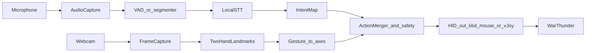

# Multimodal War Thunder controls (design document)

This repository is intentionally **documentation-first**. Treat this file as a **living README**: revise it as decisions change, measurements land, and scope grows.

## Vision

Build a **local** assistant that maps **voice** and **camera-based hand/arm gestures** to War Thunder controls so you can:

- **Voice** — select weapons and trigger discrete actions (fire extinguisher, scouting, scope modes, cannon fire, menu-style toggles, etc.).
- **Vision** — drive continuous inputs (drive direction and speed, turret traversal / aim adjustments) from **both hands / arms** at once: pose, motion, and simple gestures in frame (e.g. left vs right channel assignments in config).

Using **multiple input channels** increases redundancy and expressiveness compared to relying on a single modality.

## Problem statement

War Thunder expects fast, precise keyboard/mouse (and optionally joystick) input. The helper must:

1. Capture **microphone** and **webcam** with low added latency.
2. Run **speech recognition** and **hand understanding** **entirely on-device** (no cloud STT/vision APIs in the default design).
3. Emit **HID-level** control (keyboard/mouse synthesis as the cross-platform baseline; optional virtual joystick on Windows later).
4. Coexist with the game on **memory-constrained** systems.
5. Track and interpret **two hands** concurrently for control (not single-hand-only).

## Implementation language (decision)

**Python 3.11+** is the implementation language for v1.

Other languages (Rust, Swift, C#, TypeScript shells) can offer advantages for RAM or OS integration, but Python provides the strongest **all-around** experience for this project: one codebase for macOS (primary) and a plausible future **Windows** release, with mature libraries for audio, vision, and local inference glue.

If prototypes later hit hard CPU/RAM ceilings, hot paths can be revisited (native extensions, smaller models, or a rewritten core) without changing the high-level pipeline described here.

## Non-goals

- **Cloud inference** for speech or vision in the default architecture (adds latency, privacy, and network dependency).
- **Gameplay automation beyond input remapping** (no autopilot aimbots, no telemetry-driven cheats). This document assumes **fair control mapping** only; **compliance with game Terms of Service and anticheat expectations is your responsibility**—verify before use, especially online.

## High-level architecture

**Pipeline notes**

- **Intent map** — converts recognized phrases (or push-to-talk windows) into discrete game actions aligned with **your** War Thunder keybind profile.
- **Gesture to axes** — maps landmarks and simple gestures for **each detected hand** (e.g. palm position, fist open/closed, horizontal/vertical bias) into throttle-like or repeated key taps, depending on how you bind driving and turret controls and how you assign **left vs right** roles in config.
- **Merger + safety** — arbitration when voice and gesture conflict; optional **dead-man** behavior; global **panic disable** hotkey.

## Python stack (proposed)

| Concern | Library / approach | Notes |
| --- | --- | --- |
| Speech | [faster-whisper](https://github.com/SYSTRAN/faster-whisper) tiny/base + int8 | CTranslate2-based; macOS arm64 compatible. `lean` profile uses tiny on CPU; `rich` profile uses base, optionally GPU. |
| Voice activity | `webrtcvad` | Reduces pointless decoding; improves perceived latency. |
| Two hands / arms | [MediaPipe](https://developers.google.com/mediapipe) Hand Landmarker (**max hands = 2**) | Primary component for **simultaneous** two-hand landmarks. Add holistic / full **pose** later only if needed (extra CPU/RAM). |
| Video capture and preprocessing | `opencv-python` (`cv2.VideoCapture`, resize, color convert, optional crop) | **Not** used as the main “hand tracker”: OpenCV does not provide turnkey two-hand skeletal tracking for this use case. It feeds frames into MediaPipe and keeps capture cheap. |
| Audio capture | `sounddevice` | Tune buffer size vs latency. |
| Control output (baseline) | `pynput` | Maps to your keybinds; requires macOS permissions (below). |
| Control output (optional, Windows) | [vJoy](http://vjoystick.sourceforge.net/site/) + `pyvjoy` | Useful if you need analog-like axes instead of key chording; **Windows-only** in practice for this stack. |
| Concurrency | `asyncio` with bounded queues and/or threads | Keep capture, inference, and HID emission decoupled with backpressure. |

### OpenCV vs two-hand tracking (RAM note)

**`opencv-python` alone** is the wrong layer to expect “track two hands as structured inputs.” OpenCV gives general computer vision primitives (capture, filters, optional generic trackers or DNN wrappers); reliable **per-hand landmarks** for controls come from **MediaPipe** (or another dedicated hand model), with OpenCV handling **camera I/O and light preprocessing**.

Two hands increases **CPU** work per frame versus one hand, but it is still typically modest compared to large STT models; keep **`lean`** settings on **resolution and FPS** first if RAM or CPU is tight—not by dropping to a single hand unless you add an explicit optional fallback mode later.

## Latency budget (starting targets)

These are **design targets**, not guarantees—measure on your machine and revise this table.

| Path | Target | Mitigations |
| --- | --- | --- |
| Discrete voice command | ~300–800 ms end-to-end | VAD, short utterances, small models, grammar post-filter |
| Gesture to control | ~50–150 ms perceived | Lower camera resolution, limit smoothing delay, cap queue depth |
| Safety disable | immediate | OS-global hotkey outside game focus where possible |

## Memory and coexistence with War Thunder

War Thunder is the primary workload. The helper should default to a **`lean` profile** so RAM and VRAM remain available for the game.

### Why memory spikes happen

- Large STT models (Whisper “small” and above), especially alongside the game.
- High-resolution, high-FPS video buffers.
- **GPU VRAM contention** if both the game and ML inference use the same GPU heavily.

### Profiles

| Profile | Speech | Vision | Inference placement | When to use |
| --- | --- | --- | --- | --- |
| **`lean` (default)** | faster-whisper **tiny**, int8 | 640×480 (or similar), 15–30 FPS, **MediaPipe two hands** | Prefer **CPU** for the helper to preserve **VRAM** for the game | Everyday play on limited RAM |
| **`rich`** | faster-whisper **base**, int8 | Higher resolution/FPS, still **two hands**; optional heavier preprocessing | Optional **GPU** for STT | Spare headroom, desktop tuning sessions |

### Additional mitigations

- Optional **push-to-talk** or time-gated listening so STT models are not always resident.
- **Unload** heavy models when idle if implementation supports it.
- Avoid loading **multiple** heavy runtimes at once (e.g. duplicate ONNX + Torch stacks).
- Prefer **single-process** architecture until profiling proves a split is worthwhile.

## Platform matrix

| Topic | macOS (primary testing) | Windows (future release) |
| --- | --- | --- |
| Input injection | `pynput` + **Accessibility** (and likely **Input Monitoring**) in System Settings | `pynput` baseline; test with same game build settings as Mac where possible |
| Virtual joystick | No vJoy path assumed for Mac v1 | Optional **vJoy** for analog-style axes if key chording is insufficient |
| Packaging | TBD (`pyinstaller`, `briefcase`, etc.) | Same codebase; validate drivers and AV false positives |
| Permissions | Prompt and document Accessibility clearly in app UX | UAC / security software may block synthetic input—document for users |

## Phased roadmap

1. **Phase A — Mapping and logging** — Read config for War Thunder keybinds; log “would press key X” without sending input; prove config UX.
2. **Phase B — Voice** — faster-whisper phrase list for weapons and discrete actions; push-to-talk optional.
3. **Phase C — Vision** — MediaPipe **two-hand** tracking; map per-hand gestures to drive/turret (and other) controls with smoothing, deadzones, and stable **left/right** assignment.
4. **Phase D — Fusion and safety** — Merge modalities, debounce conflicts, **global disable**, and clear on-screen or audio feedback for state (armed phrase, gesture mode).

## Open questions

Record answers here as you decide them.

- [ ] Approximate **system RAM** and **GPU model** (sets default profile tuning).
- [ ] Camera **placement and lighting** (desk mount vs arm; background clutter).
- [ ] **Per-hand roles** (e.g. left hand = drive, right hand = turret) and behavior when one hand leaves the frame.
- [ ] Turret control style: **relative** nudges vs **absolute** screen mapping.
- [ ] Online vs test range only; **ToS** stance and feature gating.
- [ ] Push-to-talk key vs always-listening window vs wake phrase (latency vs convenience vs RAM).
